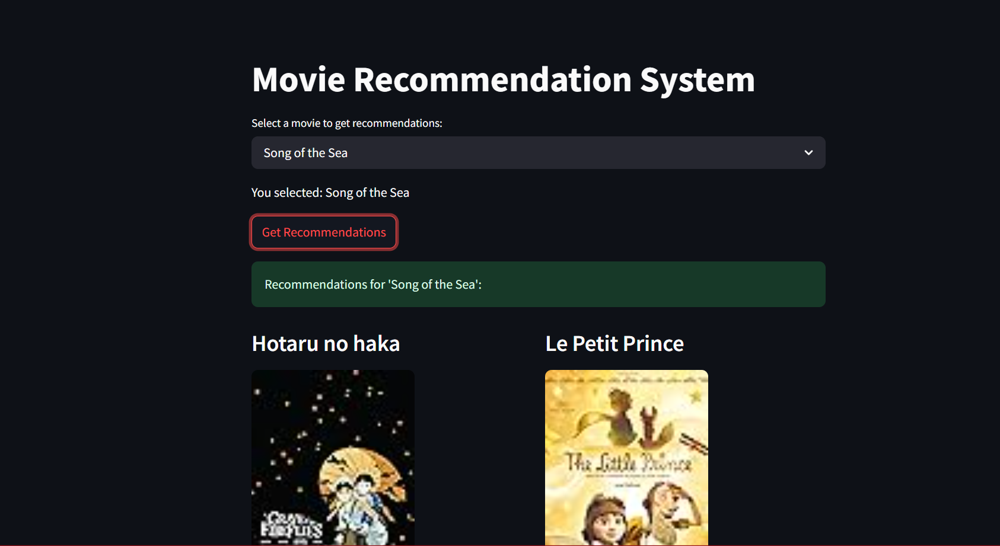

# Movie Recommendation System

A content-based Movie Recommendation System built using **Streamlit** that suggests similar movies based on cosine similarity of features like genre, description, and more.

---

##  Features

- Select a movie from the dropdown and get top similar movies.
- View movie poster, overview, and director details.
- Intuitive UI powered by Streamlit.
- Uses precomputed cosine similarity for fast results.

---

## Project Structure

```
├── app.py                    # Main Streamlit application
├── original_movies.csv       # Dataset with complete movie details
├── processed_movies.csv      # Preprocessed dataset for similarity computation
├── cosine_sim.pkl            # Precomputed cosine similarity matrix
├── README.md                 # Project documentation
```

**cosine_sim.pkl**  The cosine similarity matrix (cosine_sim.pkl) was generated in Google Colab using TF-IDF vectorization and then downloaded to be used locally in this Streamlit app.

**original_movies.csv**: Contains full details of movies (title, overview, director, poster link, etc.)

**processed_movies.csv**: Contains cleaned/preprocessed titles used for similarity lookup.
---

## How It Works

1. **Movie Selection**: User selects a movie from the dropdown.
2. **Similarity Check**: Cosine similarity matrix is used to find top N similar movies.
3. **Display Details**: For each recommended movie, details like poster, overview, and director are fetched and displayed.

---

## Screenshot

Here's how the app looks:




